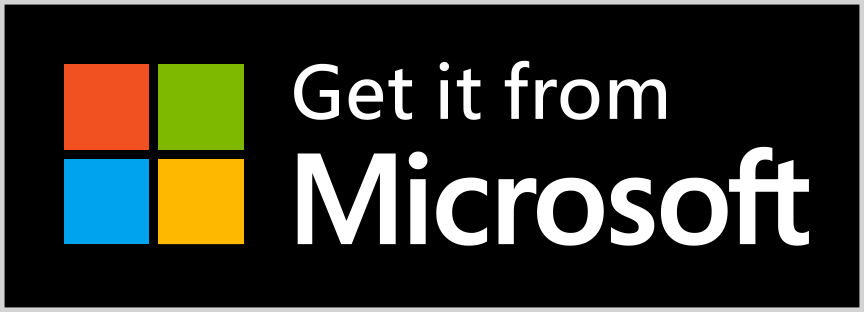

# ClefExplorer (Leitor de Logs CLEF)

O **ClefExplorer** é uma aplicação desktop moderna desenvolvida para facilitar a leitura, análise e monitoramento de logs estruturados no formato **CLEF (Compact Log Event Format)**. Construído com **.NET 10**, **Windows Forms** e **Blazor Hybrid**, ele oferece uma interface ágil e rica para desenvolvedores e administradores de sistemas que utilizam Serilog ou outras bibliotecas de log estruturado.


## Download
As versões estão disponíveis neste repositório do GitHub junto com a Windows Store

### Windows
<a href='https://www.microsoft.com/store/apps/9MVZN1HVJ230?cid=storebadge&ocid=badge'></a>


## 🚀 Funcionalidades Principais

### 📂 Carregamento de Logs
- **Arquivos Individuais:** Abra arquivos .clef diretamente.
- **Pastas:** Carregue diretórios inteiros; o aplicativo busca recursivamente por arquivos .clef e .clef.gz.
- **Suporte a GZip:** Leitura nativa de arquivos de log compactados (.clef.gz).
- **Arrastar e Soltar:** (Suporte via seleção de arquivo/pasta no sistema).

### 📚 Gerenciamento de Grupos
- Crie grupos de logs para acesso rápido (ex: "Produção", "Homologação", "API Vendas").
- Adicione múltiplos caminhos (arquivos ou pastas) a um único grupo.
- Suporte a **variáveis de ambiente** nos caminhos (ex: %localappdata%\MyApp\Logs).

### 🔍 Visualização e Filtragem
- **Filtros Rápidos:** Alterne facilmente entre níveis de log (Error, Warning, Information).
- **Filtro por Data:** Defina um intervalo de datas para restringir a busca.
- **Busca Textual:** Pesquise instantaneamente em mensagens, exceções e propriedades do log.
- **Filtro de Origem:** Ative ou desative a visualização de arquivos específicos carregados.
- **Paginação:** Navegação eficiente mesmo com grandes volumes de dados.

### 🛠️ Ferramentas de Análise
- **Detalhes do Log:** Visualize a mensagem completa, timestamp preciso e nível.
- **Stack Trace Highlighter:** Exceções são formatadas e coloridas para facilitar a leitura.
- **Propriedades Estruturadas:** Visualize todas as propriedades do evento de log em uma tabela organizada.
- **Correlation ID:** Clique em IDs de correlação para filtrar todos os logs relacionados a uma mesma requisição.

### ⚙️ Configurações
- **Ignorar Arquivos:** Defina padrões (wildcards) para ignorar arquivos indesejados (ex: *backup*).
- **Ignorar Linhas:** Configure textos para ocultar linhas de log que são ruído (ex: health checks).

## 📋 Pré-requisitos

- Sistema Operacional: **Windows 10/11** (x64)
- Runtime: **.NET 10 Desktop Runtime** (ou SDK para compilação)
- **WebView2 Runtime** (geralmente já instalado no Windows)

## 🔧 Instalação e Execução

1. **Clonar o repositório:**
   ```bash
   git clone https://github.com/afernandes/ClefExplorer.git
   cd ClefExplorer
   ```

2. **Compilar e Executar (via CLI):**
   ```bash
   cd src
   dotnet build
   dotnet run
   ```

3. **Publicar (Gerar executável):**
   ```bash
   dotnet publish -c Release -r win-x64 --self-contained
   ```

## 📖 Guia de Uso

### Abrindo Logs
Utilize a barra lateral esquerda para:
- **Abrir Arquivo:** Selecione um único arquivo .clef.
- **Abrir Pasta:** Selecione uma pasta para carregar todos os logs contidos nela.
- **Grupos:** Clique em um grupo salvo para carregar todos os caminhos configurados nele.

### Gerenciando Grupos
1. Clique no ícone de engrenagem ou "Gerenciar Grupos" na barra lateral.
2. Clique em "Novo Grupo".
3. Adicione caminhos (arquivos ou pastas). Você pode digitar caminhos manuais usando variáveis como %TEMP%.
4. Salve o grupo.

### Analisando um Erro
1. Use o **Filtro Rápido** para selecionar "Error".
2. Clique em um registro na lista para ver os detalhes no painel direito.
3. Se houver uma exceção, o **Stack Trace** será exibido com destaque de sintaxe.
4. Clique no botão de copiar no cabeçalho da exceção para copiar o stack trace para a área de transferência.

## 💻 Tecnologias Utilizadas

- **.NET 10**
- **Windows Forms** (Host nativo)
- **Blazor Hybrid** (Interface de usuário web dentro do desktop)
- **Microsoft.AspNetCore.Components.WebView.WindowsForms**
- **Serilog** & **Serilog.Formatting.Compact.Reader** (Parsing de logs)
- **Omni.Blazor** (Biblioteca de componentes / design system - pacote NuGet `AndersonN.Omni.Blazor`)

## 📄 Licença

Este projeto está licenciado sob a licença MIT - veja o arquivo [LICENSE](LICENSE) para mais detalhes.
